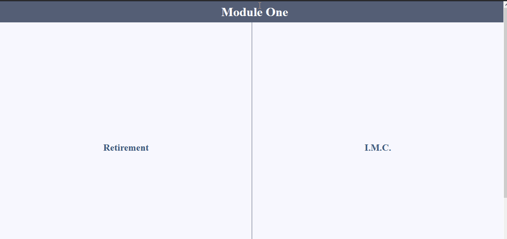

# ´Projeto da [Rocketseat](https://rocketseat.com.br/) - Turma LaunchBase 2020

## 🏋️‍♀️ Desafios:

## [1-1](https://github.com/Rocketseat/bootcamp-launchbase-desafios-01/blob/master/desafios/01-1-primeiros-passos-com-js.md): Primeiros passos com JS.

em construção

---

### 🧠 Os desafios fortaleceram os conceitos:
 - Objetos e Vetores;
 - Funções e métodos;
 - Estrutura de repetição;

 ---

 ### 🎯 Objetivo dos desafios:
 - Criar um programa que calcula o IMC e nível de obesidade de uma pessoa;
 - Criar um programa que verifica se uma pessoa pode se aposentar;

em construção

 ---

 ### 🎥 Ilustração da aplicação:
<h3>
    
</h3>

